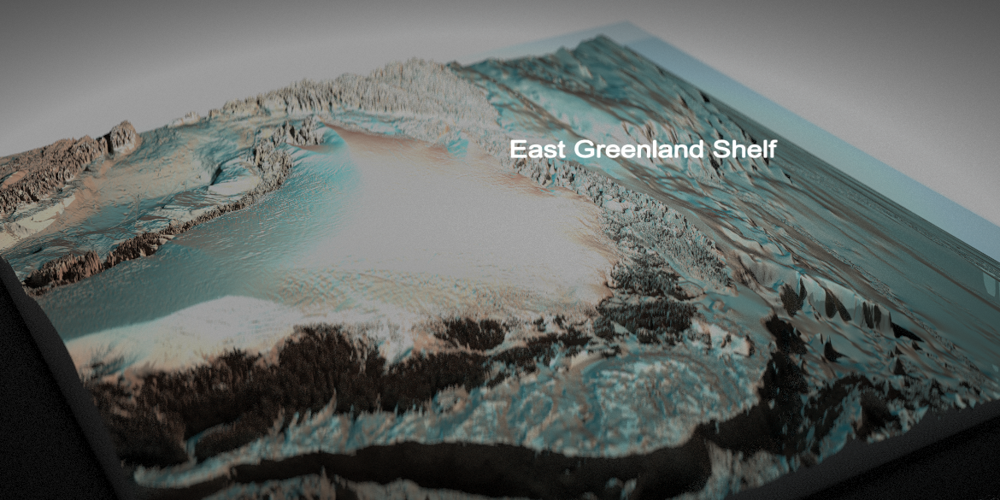

# MiMeMo.EastGreenlandShelf

This repository houses the code for parameterising the end to end
ecosystem model strathE2E*polar* for the East Greenland Shelf. Scripts are
loosely classified into families
-*bathymetry*-*flows*-*nemo-medusa*-*saltless*-*StrathE2E*. The
site and docs directories build a full set of documentation, R scripts
and Figures are self-explanatory directories.

You can find the full documentation on github pages
[here](https://jack-h-laverick.github.io/MiMeMo.EastGreenlandShelf/)

This work is part of MiMeMo. Other MiMeMo repositories cover a
parameterisation for the Barents Sea, Building sediment maps
for both regions, and the development of R packages used for these
projects (*MiMeMo.tools*, *nemomedusR*).
